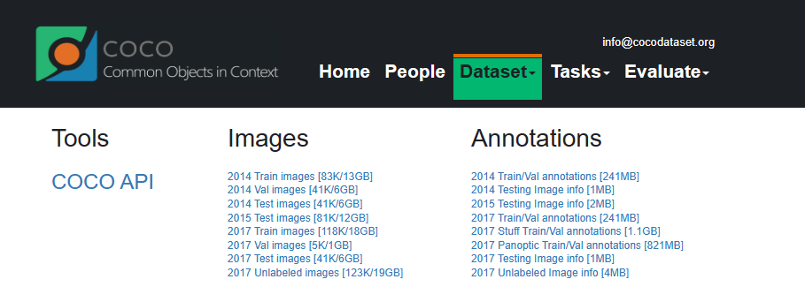
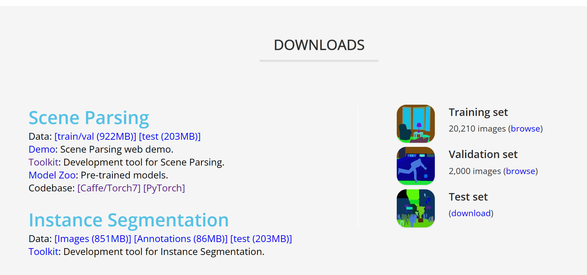

以下内容是唐武阳用mask2former在医学影像数据集上训练自己模型的项目记录。
# Mask2former环境配置与运行
Github地址：[Mask2Former](https://github.com/facebookresearch/Mask2Former)
## 安装环境
### miniconda
下载官网地址：[Miniconda — miniconda 文档](https://docs.conda.io/projects/miniconda/en/latest/index.html)  
配置环境变量：[Linux设置miniconda环境变量-CSDN博客](https://blog.csdn.net/weixin_47145054/article/details/130198807)  
无sudo权限可在Windows更改完后上传。  
miniconda使用说明：[Linux下Miniconda的安装及其使用-CSDN博客](https://blog.csdn.net/riwanba/article/details/131661914)
### Python
安装的软件包：
python=3.8  
pytorch\==1.9.0 torchvision\==0.10.0 cudatoolkit=11.1  
&emsp;推荐安装cuda=11.1的。归根结底要跟自己的服务器上的cuda版本相匹配，以便于后续Detectron2安装版本匹配。
	“Detectron2 CUDA Compiler”、“CUDA_HOME”、“PyTorch built with - CUDA”相匹配
```bash
python -m detectron2.utils.collect_env
```

Detectron2：[Detectron2安装说明](https://detectron2.readthedocs.io/tutorials/install.html)  
	建议从源码安装，
  ```bash
# 在工作目录下使用下列指令下载detectron2
git clone https://github.com/facebookresearch/detectron2.git
python -m pip install -e detectron2
```
opencv=4.8.1  
其他必备的库（在requirements.txt中）
	`pip install -r requirements.txt`
#### 全流程实例：

```bash
conda create --name mask2former python=3.8 -y
conda activate mask2former
conda install pytorch==1.9.0 torchvision==0.10.0 cudatoolkit=11.1 -c pytorch -c nvidia
pip install -U opencv-python

# under your working directory
git clone https://github.com/facebookresearch/detectron2.git
cd detectron2
pip install -e .
pip install git+https://github.com/cocodataset/panopticapi.git
pip install git+https://github.com/mcordts/cityscapesScripts.git
# 转到Mask2Former的路径下
cd ..
# git clone git@github.com:facebookresearch/Mask2Former.git
cd Mask2Former
pip install -r requirements.txt  # 安装其他必备库
cd mask2former/modeling/pixel_decoder/ops  # 为 MSDeformAttn 编译 CUDA 内核
sh make.sh
```

## 安装数据集
目前只装了COCO，ADE20K（语义分割部分）数据集
### 数据集路径准备
Detectron2查找数据集的路径如下：
```shell
$DETECTRON2_DATASETS/
  ADEChallengeData2016/
  coco/
  cityscapes/
  mapillary_vistas/
```
其中`$DETECTRON2_DATASETS`为环境变量中指定的内置数据集的位置。如果未设置，则默认值相对于当前工作目录下的`./datasets`  
**环境变量设置**：  
	在`.bashrc`文件中写入
	`export DETECTRON2_DATASETS=/path/to/datasets`  
	然后在终端输入：`source ~/.bashrc`更新配置文件
### 数据集下载
#### COCO
[COCO下载](https://cocodataset.org/#download)  
Images中需要下载**2017 Train/Val images**  
Annotations中需要下载**2017 Train/Val annotations** 和 **2017 Panoptic Train/Val annotations**
  
**预期数据集结构：**
```shell
coco/
  annotations/
    instances_{train,val}2017.json
    panoptic_{train,val}2017.json
  {train,val}2017/
    # image files that are mentioned in the corresponding json
  panoptic_{train,val}2017/  # png annotations
  panoptic_semseg_{train,val}2017/  # 这是由下文所示脚本文件生成的文件路径
```
在工作目录下使用如下指令下载数据集压缩包：  
	`wget 下载链接`，然后解压指定文件：`unzip 指定文件`最终达到上文所示文件结构。  
**安装 panopticapi**：  
	`pip install git+https://github.com/cocodataset/panopticapi.git`  
**从全景注释中提取语义注释（仅用于评估）**:  
	`python datasets/prepare_coco_semantic_annos_from_panoptic_annos.py`
	生成panoptic_semseg_文件

#### ADE20K for Semantic seg
[ADE20K下载](http://sceneparsing.csail.mit.edu/)  
下载Scene Parsing中的Data。  
  
预期数据结构：
```shell
ADEChallengeData2016/
  images/
  annotations/
  objectInfo150.txt
  # generated by prepare_ade20k_sem_seg.py
  annotations_detectron2/
```
运行如下指令生成`annotations_detectron2/`：
`python datasets/prepare_ade20k_sem_seg.py`

## 解决报错
当装好环境和数据集后，尝试运行训练文件`train_net.py`
需要修改GPU数目，服务器数目，并自行指定学习率和batch_size大小
```python
python train_net.py --config-file configs/coco/panoptic-segmentation/maskformer2_R50_bs16_50ep.yaml --num-gpus 1 --num-machines 1 SOLVER.IMS_PER_BATCH 2 SOLVER.BASE_LR 0.0001
```
#### 1.unexpected keyword argument 'dtype' in torch.cuda.autocast
可以看到第一个报错是意外实参dtype，定位到代码位置是`detectron2/detectron2/engine/train_loop.py/493`  
试分析**问题原因**是pytorch1.9版本的`autocast()`函数不再支持参数传递  
**解决办法**是移除实参`dtype=self.precision`。  
网上查阅到的无效解决办法：[python - TypeError: \_\_init\_\_() got an unexpected keyword argument 'device_type' in torch.cuda.autocast - Stack Overflow](https://stackoverflow.com/questions/74746481/typeerror-init-got-an-unexpected-keyword-argument-device-type-in-torch)  

#### 2.AttributeError: module 'distutils' has no attribute 'version'
尝试从 distutils 模块访问 version 属性时发生此错误  
**问题原因**：因为 **setuptools 版本59.6.0**中的更改以某种方式中断了对 version 属性的调用。在最新版本中，version 属性似乎已经从 distutils 中删除。  
&emsp;运行dir()函数来确认version属性删除:
```python
from setuptools import distutils
print(distutils.__version__, dir(distutils))
```  
**解决方法**：将 setuptools 版本固定到59.5.0或升级torch  
	`pip install setuptools==59.5.0`  

参考文章：
[pytorch - AttributeError: module 'distutils' has no attribute 'version' - Stack Overflow](https://stackoverflow.com/questions/74684612/attributeerror-module-distutils-has-no-attribute-version)  
[Python AttributeError: module ‘distutils‘ has no attribute ‘version‘CSDN博客](https://blog.csdn.net/Alexa_/article/details/132686602)

# 医学数据集注册与使用
## kvasir-SEG数据集介绍
[Kvasir-SEG数据集官网](https://datasets.simula.no/kvasir-seg/)  
它是胃肠道息肉图像和相应分割mask的开放获取数据集，由经验丰富的胃肠病学家手动注释和验证。
## Detectron2数据集注册
请参考Detectron2官方文档：[数据集注册](https://detectron2.readthedocs.io/tutorials/datasets.html#register-a-dataset)  
具体配置信息可在如下位置找到：
`mask2former/data/datasets/register_kvasir_seg_semantic.py`  

## 模型必要配置
具体配置信息可在如下位置找到：
`configs/kvasir_seg/MaskFormer2_R50_bs16_160k.yaml`  

## 与mask2former模型输入相匹配
需要在semantic mapper与sem_seg_evaluation中修改mask读入方式为灰度图。  
# 项目运行与调试
运行参数与配置信息位于`./vscode/launch.json`文件中。  
&emsp;训练模型请使用`kvasir`  
&emsp;测试模型请使用`kvasir_test`  
&emsp;评估模型请使用`kvasir_evaluation`  
前端页面请使用：`streamlit run website/Interface.py` //**有待完善**  
TODO:完善实验记录，补充数据集格式和方法。拆分readme，写成总分结构